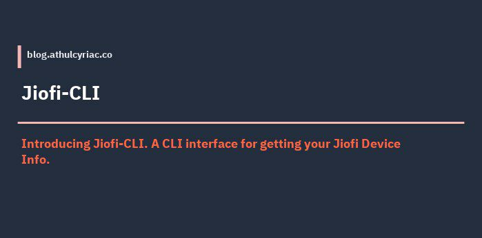
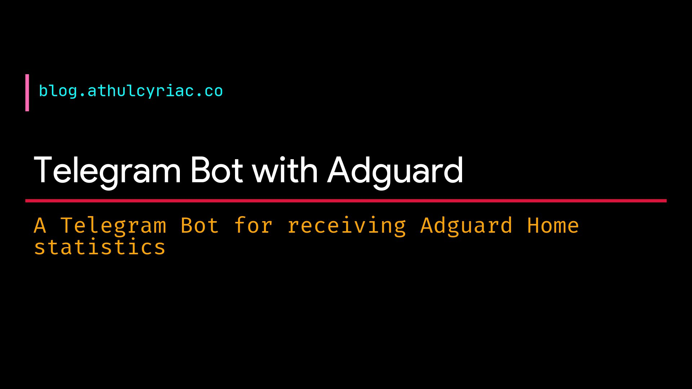

One day I was scrolling through Reddit and found a post in r/SideProject about [MugshotBot](https://www.mugshotbot.com/) and it's the ease of use intrigued me. So I immediately hacked this blog to use MugShotBot to generate Link Previews. Gatsby was a bit tedious to hack on and I'm not a Js peep myself. I just know how most of this stuff works and not to code much Js. Eventually, I made it to work with MugShotBot and this happened at midnight. I got excited and immediately implemented it 🤷‍♂️.

Fast Forward a few days, the creator of MugshotBot introduced new pricing where the free tier is crippled to just being an Image generator and not to an automatic image generation system. Thus the Hacker in me was awaken....again. The million-dollar question came to my mind,  

> Why not build something like this?

So with this being in my mind, I searched for on how I build something similar. It was relatively easy to get started. I had a few requirements for this.

- **Use the lowest code possible**(I have exams and if I spend too much on this, I'll fail them.)
- Make it easy
- Host it so that my blog could use it

These requirements of mine lead to the conclusions,

- Use Python over Go(😁)
- Implement with FastAPI since it's a simple endpoint
- Host it with [Deta] (It's free😌)

## A Bowl of Soup

For the images to be generated for link previews, the data had to be from somewhere. If I give that statically, then the whole idea of automating a blog will become null and void, and it will increase the overhead for most. So I came to "[Web Scraping]". I used BeautifulSoup and the Requests library in Python for the same. The scraped part of the webpage is the meta tags with the `og:description` and `og:title`. These are for SEO and are perfect to get the data about the page.

```py
def GetLinkData(url: str) -> str:
    soup = BeautifulSoup(requests.get(url).content, "html.parser")
    description = soup.find("meta", property="og:description").get("content")
    title = soup.find("meta", property="og:title").get("content")
    return title, description
```

All the code will be provided at the end.

Thus step 1 is over **"Get the Data"**. Step 2 is to generate images with this data

## Pillowverse

Pillow is Python's Image Library. It's easy to use and implement stuff with. I had recently used Pillow to generate certificates for our college event. The event coordinator was surprised to get all the certificates generated within minutes rather than the usual days taken by the designers here. So I used Pillow(PIL) to load the image, write to the Image and save the image. I created a simple image in Figma for purposes. Here is the image I created at first(I'm not a design geek either)


 I know this isn't the best but it was enough to get started with the rest. So I created a function to load the image, write on the image and save the image.
Here is a sample output of the image generated by Python



The quality of image is low, I know but this is unnoticeable for link previews. As in for the 1st iteration this was successfull. Here is the code,

```py
def drawImage(title, description, sfurl, url):
    wrapper = textwrap.TextWrapper(width=45)
    word_list = wrapper.wrap(text=description)
    caption_new = ""
    for ii in word_list[:-1]:
        caption_new = caption_new + ii + "\n"
    caption_new += word_list[-1]
    img = Image.open("bg-black.png")
    draw = ImageDraw.Draw(img)
    draw.text((107,222), url.strip("https://").split("/")[0], "aqua", font=ImageFont.truetype("jb.ttf", 45))
    if len(title) > 30:
        draw.text((92,410), title, "white", font=ImageFont.truetype("ps.ttf", 70))
    else:
        draw.text((92,410), title, "white", font=ImageFont.truetype("ps.ttf", 100))
    draw.text((92,590), caption_new, "orange", font=ImageFont.truetype("fira.ttf", 60))
    rgb_im = img.convert("RGB")
    rgb_im.save("image.jpeg", "JPEG", quality=100, progressive=True)
```

You can see that I'm using a bit of string manipulation to write the description without overflowing on the image. Found that hack from StackOverflow 🙃. The bigger font sizes are for HD images(1920x1080).

Okay, so that's it for step 2. It was an easy hack, wasn't it? The next step is to bring it all together to use it with FastAPI to build the API part

## Fast AF

Implementing an API with FastAPI is quite easy if you know any other backend framework in Python like Flask or Django, it becomes a lot easier. Our API will be only having a single endpoint for the images. We'll use URL params to get the URL from which we'll get the data for generating the image. We'll call the `drawImage()` function to generate the image and give out the response. If you want to know more about using FastAPI, check out my other [post](https://blog.athulcyriac.co/fastapi_deta/)

```py

@app.get("/img")
async def getUrlData(url: Optional[str] = None):
    try:
        sufUrl = url.strip("https://").split("/")[1]
    except IndexError:
        sufUrl = url.strip("https://")
    siteData = GetLinkData(url)
    title = siteData[0]
    description = siteData[1]
    img = drawImage(title, description, sufUrl, url)
    return FileResponse(img)

```
And that's it. That's the API for us. I then Deployed this on Deta if it works. Turned out Deta's **File System was read-only**. This meant that I couldn't save the image to Deta instantly so I had to check for other alternatives.

## Bytes...Bytes...Bytes

Why not save the image as bytes? That'd be easier and less storage dependant. I searched on StackOverflow to send an image as Bytes with FastAPI. Turned out FastAPI did that pretty well. StreamingResponse was built with this in mind 🧠. I refactored the Image generation and Image response code to work with byte data. It became a tad faster than expected. Here is the code for the same. 1st the refactored code of the image generation

```py
    img_io = BytesIO()
    rgb_im.save(img_io, "JPEG", quality=100, progressive=True)
    img_io.seek(0)
    return img_io
```

Next for the API part we only have to change a single line

```py
return StreamingResponse(
            img,
            media_type="image/jpeg",
            headers={"Content-Disposition": 'inline; filename="Image.jpeg"'},
        )
```

These changes did the trick. It worked. I deployed it on Deta and it worked perfectly. Later I implemented a TempDir trick to send a generated image faster. This worked pretty well for consecutive requests but as soon as the deta micro sleeps, the tempdir will be deleted. Not a persistent way but it works and makes it a lot fast for consecutive requests.

---

I deployed this version on Deta and it works fine. Easier Link Previews and a fun hobby hack. I'm planning to make it a SaaS offering but I couldn't find the time. This is a basic version which simply works. If I'm going to build it to a SaaS idea need to make more performance boosters and introduce caching and multi-image styles. Need more advice on these 🤓

One drawback I found was that Emoji doesn't seem to render correctly. Might bring up a hack for it in the future. You can find the code [here](https://github.com/athul/img-gen) (MIT Licence)

---

Here is the Full Code(with the TempDir hack too)

```python
from fastapi import FastAPI
from typing import Optional, List
import requests
import textwrap
import os
import time
from io import BytesIO
from PIL import Image, ImageDraw, ImageFont
from bs4 import BeautifulSoup
from fastapi.responses import StreamingResponse, FileResponse
import tempfile

temp_dir = tempfile.TemporaryDirectory()
app = FastAPI()


def GetLinkData(url: str) -> str:
    soup = BeautifulSoup(requests.get(url).content, "html.parser")
    description = soup.find("meta", property="og:description").get("content")
    title = soup.find("meta", property="og:title").get("content")
    return title, description


def drawImage(title, description, sfurl, url):
    st_time = time.time()
    wrapper = textwrap.TextWrapper(width=45)
    word_list = wrapper.wrap(text=description)
    caption_new = ""
    for ii in word_list[:-1]:
        caption_new = caption_new + ii + "\n"
    caption_new += word_list[-1]
    img = Image.open("bg-black.png")
    draw = ImageDraw.Draw(img)
    print(len(title))
    draw.text((107,222), url.strip("https://").split("/")[0], "aqua", font=ImageFont.truetype("jb.ttf", 45))
    if len(title) > 30:
        draw.text((92,410), title, "white", font=ImageFont.truetype("ps.ttf", 70))
    else:
        draw.text((92,410), title, "white", font=ImageFont.truetype("ps.ttf", 100))
    draw.text((92,590), caption_new, "orange", font=ImageFont.truetype("fira.ttf", 60))
    rgb_im = img.convert("RGB")
    rgb_im.save(f"{temp_dir.name}/{sfurl}.jpeg", "JPEG", quality=100, progressive=True)
    img_io = BytesIO()
    rgb_im.save(img_io, "JPEG", quality=100, progressive=True)
    img_io.seek(0)
    print(f"Image Gen: {time.time()-st_time}")
    return img_io


def checkImageinDir(url):
    for _, _, f in os.walk(temp_dir.name):
        for _file in f:
            print(f)
            if url in _file:
                print("Kitti", _file)
                return True
        else:
            print("Illa")
            return False


@app.get("/")
def getHey():
    return {"message": "Hello World"}


@app.get("/img")
async def getUrlData(url: Optional[str] = None):
    start = time.time()
    try:
        sufUrl = url.strip("https://").split("/")[1]
    except IndexError:
        sufUrl = url.strip("https://")
    if checkImageinDir(sufUrl) is True:
        print(f"Temp File Find exec time {time.time()-start}")
        return FileResponse(f"{temp_dir.name}/{sufUrl}.jpeg")
    else:
        siteData = GetLinkData(url)
        title = siteData[0]
        description = siteData[1]
        img = drawImage(title, description, sufUrl, url)
        print(f"Image Gen Response time {time.time()-start}")
        return StreamingResponse(
            img,
            media_type="image/jpeg",
            headers={"Content-Disposition": 'inline; filename="Image.jpeg"'},
        )
```

Here is an Updated Preview I made with a new colour design for a post on this blog itself.



---

If you found it useful, you can donate me on [BMC ☕️](https://www.buymeacoffee.com/athulca) or [Paypal](https://paypal.me/athulca) and can reach out to me on [Twitter](https://twitter.com/athulcajay)

[Deta]:https://deta.sh
[Web Scraping]:https://en.wikipedia.org/wiki/Web_scraping
