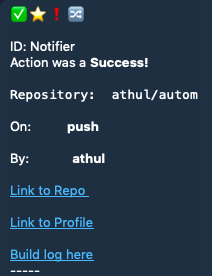
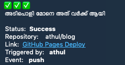

### The Story Behind
So, these few days I've been working on [Shelby](https://github.com/athul/shelby) a lot. For handling the releases section I used Travis CI and Travis really does a good job at it.   
The only thing about travis is that it takes time to *complete the build and deploy cycle*. Starting with the docker container to the deployment. We'd have to wait in the build page for a few minutes till the build&deploy is completed. That's just waste of productive time I'd say. Maybe in that time we could do something else like searhing stackoverflow for a previous error or read the docs to find out how it works better. And to check if the build failed or succeded, I'd have to go back to Travis' page and meh, it's just lazy.

So I googled for any solutions to get me notified. I found this medium article where the author made a Shell Script to use it with Travis and sends you a notification on the **build's status in Telegram using a Bot.** I didn't knew that a Shell Script is enough for a telegram bot to work.

I loved the idea, and copied the script and used it with some changes in the output message. It was fast alright. As soon as the build completed I'd get a Message in Telegram regarding the status. 
### The Story Now
I tweaked the same script to use it along GitHub Actions and boy, its fast alright.
The solution I used before this was a GitHub Action I made for notifying meon Builds using GitHub actions. It was called [Statusoli](https://github.com/athul/statusoli).     
I made it using docker actions template and Go. I made different versions for it in different branches of the Repo. The `star` branch had an output message for notifying about new stars in the repo. The `notify` branch is for notifying about any new pull  request or issues opened,closed,assigned or reopened. The `master` branch is just for sending a message regarding only the build status. 
And all of it included a Malayalam Text, I made it just for fun🤷‍♂️.

Now the shell script for GitHub Actions Telegram Notify is a small one, You can find all of my scripts [here](https://github.com/athul/autom).

You just have to add these lines to the action
```yml
    - name: Notifier
      env:
        TELEGRAM_CHAT_ID: ${{ secrets.TELEGRAM_CHAT_ID}}
        TELEGRAM_TOKEN: ${{secrets.TELEGRAM_TOKEN }}
        INPUT_STATUS: ${{ job.status }}
      run: sh -c "$(curl -sL https://raw.githubusercontent.com/athul/autom/master/tg_gh_action_noti.sh)"

```
> The `TELEGRAM_TOKEN` and the `TELEGRAM_CHAT_ID` should be added to the repository secrets in the repository settings. Be in mind that these Secret's Name is case sensitive.

- Here the `TELEGRAM_CHAT_ID` is the chat id you want the bot to send the messages to. You can find your chat id by speaking to `jsondumpbot` in telegram. 
- The `TELEGRAM_TOKEN` is your Telegram bot's API Key. You can create a new bot by talking to `botfather` bot in Telegram
- The `INPUT_STATUS` is something the actions have, you don't have to pass anything to it.
The Shell script mostly uses Action's Environment Variables. So you'd have to define the trigger on which the action should be done. Check [this Guide](https://help.github.com/en/actions/automating-your-workflow-with-github-actions/events-that-trigger-workflows) for references.
And     

----

Screenshots:  1. Shell Script, 2. Statuoli  
   
     
**Happy New Year Ya'll**
